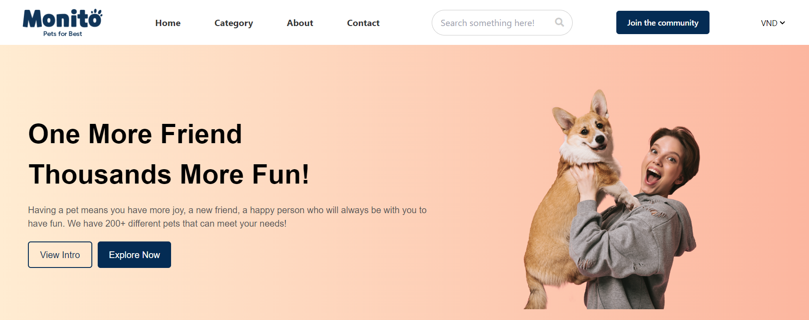

# Monito: Pet Store Web Application


Welcome to **Monito**, a modern, user-friendly web application for pet lovers to explore and adopt pets or shop for a variety of pet products. The app is designed with responsiveness in mind, providing a seamless experience across both desktop and mobile platforms.



---

## Table of Contents

- [Features](#features)
- [Getting Started](#getting-started)
- [Usage](#usage)
- [Common Components](#common-components)
- [Screenshots](#screenshots)
- [Contributing](#contributing)
- [License](#license)

---

## Features

- **Explore Pets**: Browse and filter through a wide range of pets, including details like breed, age, and price.
- **Product Listings**: Shop for pet food, toys, accessories, and more with prices and offers.
- **Responsive Design**: Optimized for both laptop and mobile views.
- **User-Friendly Navigation**: Intuitive layout for easy browsing.
- **Join the Community**: Subscribe and become part of the Monito pet community.
- **Filtering & Sorting**: Filter pets and products by different attributes.
- **Adoption Information**: Learn about adoption processes and find helpful articles.

---

## Getting Started

### Prerequisites

To run this project locally, you need to have the following installed:

- [Node.js](https://nodejs.org/en/download/)
- [npm](https://www.npmjs.com/get-npm) (or [yarn](https://yarnpkg.com/getting-started))

### Installation

1. Clone the repository:
   ```bash
   git clone https://github.com/your-username/monito-app.git
   cd monito-app
